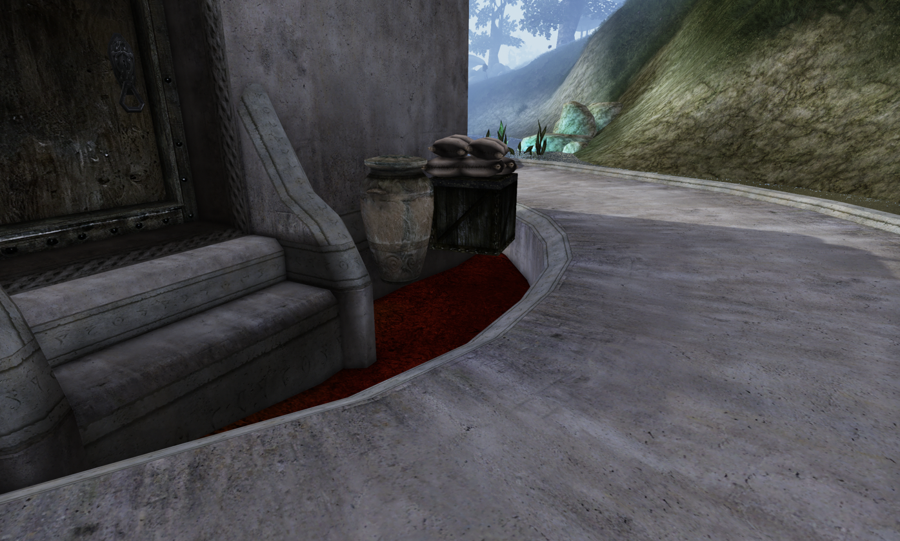

# Merged Lands

`merged_lands.exe` is a tool for merging land in TES3 mods.

The output of the tool is a plugin called `Merged Lands.esp` that should go at the end of your load order.
Yes, that includes after `Merged Objects.esp` if you're using `TES3Merge`.

The plugin contains a merged representation of any `LAND`, `LTEX`, and `CELL` records edited by mods.

## How?

1. The tool builds a "reference" landmass by merging all `.ESM` plugins using a similar algorithm as Morrowind.
2. The tool calculates a "difference" landmass for each mod _with respect to the reference landmass_.
3. The tool copies the "reference" landmass into a new "merged" landmass.
4. For each "difference" landmass from a plugin, the tool merges it into the "merged" landmass. If mods do not overlap with their changes, the resulting terrain will perfectly match both mods' intended changes. If there _is_ overlap, the tool will attempt to resolve the conflicts in an intelligent manner.
5. The "merged" landmass is checked for seams and repaired if necessary.
6. The "merged" landmass is converted into the `TES3` format and saved as a plugin.

## Limitations

- The tool does NOT move entities within the cell. This may result in floating or buried objects. This may include grass from any grass mods, or similar landscape detailing.
- The tool does NOT perform magic. If one mod puts a hill in the exact same spot another mod tries to put a valley, the resulting land will likely be less than appealing.

## Installation & Usage

1. Create a folder for the tool's executable, e.g. `merged_lands_bin`.
2. Create a directory in that folder called `Conflicts`.
3. Place the executable in the `merged_lands_bin` folder.

You should have a directory tree that looks like the following:

```
merged_lands_bin\
    merged_lands.exe
    Conflicts\
```

To run the tool, open a terminal (e.g. `cmd`) in the `merged_lands` directory and pass the path to your Morrowind `Data Files` directory with the `--data-files-dir` flag.

```bash
# Example of running the tool
merged_lands_bin> .\merged_lands.exe --data-files-dir "C:\Program Files (x86)\Steam\steamapps\common\Morrowind\Data Files"
```

An example configuration for `MO2` is shown below.


### Outputs

By default, the tool will save the output `Merged Lands.esp` in the `Data Files` directory. 

This can be changed with the `--output-file-dir` and `--output-file` arguments.

### Troubleshooting Merges

The tool will save the log file to the `--merged-lands-dir`. This defaults to `.`, or "the current directory".

The tool will save images to a folder `Conflicts` in the `--merged-lands-dir`.

```
merged_lands_bin\
    merged_lands.exe
    merged_lands.log   <-- Log file.
    Conflicts\
        ...            <-- Images of conflicts.
```

A conflict image shows `green` where changes were merged without any conflicts, whereas `yellow` means a minor conflict occurred, and `red` means a major conflict occurred. 
In addition, the tool creates `MERGED` map showing the final result.

**Note:** Each conflict image is created relative to a specific plugin. This makes it easier to understand how the final land differs from the expectation of each plugin.


In addition, the tool can be run with the `--add-debug-vertex-colors` switch to color the actual `LAND` records saved in the output file.
This feature can help with understanding where a conflict shown in the `Conflicts` folder actually exists in-game and the severity of it with respect to the world.



### Other Configuration

Run the tool with `--help` to see a full list of supported arguments.

## Supporting Patches

The tool will automatically read `.mergedlands.toml` files from the `Data Files` directory.

```bash
Data Files\
    Cantons_on_the_Global_Map_v1.1.esp
    Cantons_on_the_Global_Map_v1.1.mergedlands.toml
```

These files are used to control the tool's behavior.

### Example 1. `Cantons_on_the_Global_Map_v1.1.mergedlands.toml`

This patch file would instruct the tool to ignore all changes made by the mod except for those related to `world_map_data`.
Then, for those changes only, the mod would resolve any conflicts with other mods by using the changes from `Cantons on the Global Map` instead.

```toml
version = "0"
meta_type = "Patch"

[height_map]
included = false

[vertex_colors]
included = false

[texture_indices]
included = false

[world_map_data]
conflict_strategy = "Overwrite"
```

### Example 2. `BCOM_Suran Expansion.mergedlands.toml`

The Beautiful Cities of Morrowind Suran Expansion mod should load after `BCoM`. It modifies the same land, and we would like to prefer the changes from Suran Expanson over the normal `BCoM` edits. We can set each field to `"Overwrite"`.

```toml
version = "0"
meta_type = "Patch"

[height_map]
conflict_strategy = "Overwrite"

[vertex_colors]
conflict_strategy = "Overwrite"

[texture_indices]
conflict_strategy = "Overwrite"

[world_map_data]
conflict_strategy = "Overwrite"
```

The example conflict shown above in [Troubleshooting Merges](#troubleshooting-merges) is now fixed.


### Example 3. Ignoring Changes

If we'd like a mod to load after another mod and _not_ try to merge changes where those mods conflict, we can use the `"Ignore"` setting.
For example, if we knew that some mod would overwrite texture changes from an earlier mod, and we wanted to prevent that, we could do the following:

```toml
version = "0"
meta_type = "Patch"

[texture_indices]
conflict_strategy = "Ignore"
```

### Defaults

Each type of `LAND` record is `included = true` and `conflict_strategy = "Auto"` by default. `"Auto"` allows the tool to determine an "optimal" way to resolve conflicts -- whether that means merging, overwriting, or even ignoring the conflict.
You should not write a `.mergedlands.toml` file until it is known to be necessary.